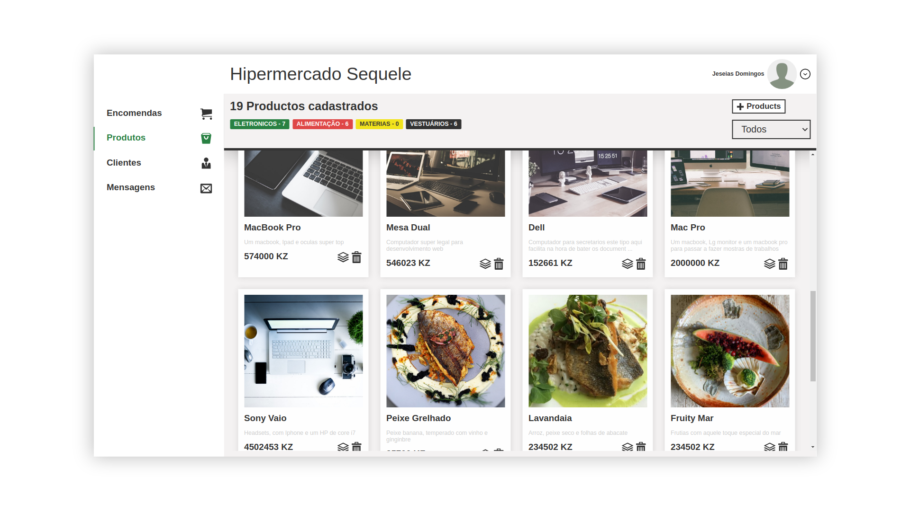

# E-commerce Applicaiton (__Dashboard__) 🛒🛒🛒

__🏗 This aplication is still under development. But almost complete 🏗__

 

# App Info 🔤

__This application 🍰 belongs to a collection of other other apps which work hand in hand to create a great e-commerce application 🎂.__

> ## App division 
> 1. **Clients** webapp to browse and order products
> 2. **Administrators** webapp to get all client orders
> 3. **RESTfull API** to connect both **webapps**  

**I am planning on building 🧱 a mobile app so clients can order on their smarphones 📱 aswell. I'll be using ReactNative.**

 

# Admins (__Dashboard__) Webpage ℹ️

**This piece 🍕 of the application is the one which admins will have access to.**

> ## Features 😎
>- See a **List** of all orders done by clients 🛒  
>- Activate  **orders** so clients know thier item is on the way 🤗 
>- On **PRODUCTS** Create, Update, List and delete 🍡
>- See a **List** of all clients 👱
>- See all **Mesages** sent by clients 🍂

You can visit this webapp <a target="_blank" href="https://admin-kerosequele.netlify.app/">here</a>.

❗ **OBS** Unfortunatley you wont have access to the website because you aint an admin user ❗

> ## Built With ⚒ ?
> **I went a little bit old fashion while building this app, but used some pretty new and cool web technologies.**
> 1. **Pug** (HTML)
> 2. **SASS** (CSS)
> 3. **Typescript** (Javascript)     
>
I've built a few <b>applications</b> already using this same approch, using <b>pug</b>, <b>SASS</b> and <b>TypeScript</b>. using webpack to compile everthing.

> 
  On their webapp I build for the clients, I used alot of similer <b>funciton</b>. So I plan on building a basic <b>framework</b>. For this kind of application.

